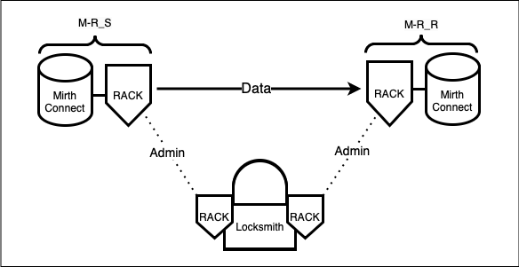

# Getting Started with RACK

Our tutorial now lives at your live documentation site:

https://docs.healthkeri.com/quickstart

This tutorial will show you how to launch two RACK Gateways and configure them to sign and encrypt all data exchanged
between two Mirth Connect integration engine instances. 

## Table of Contents

* [Requirements](#requirements)
* [What is Mirth Connect?](#what-is-mirth-connect)
* [Is Mirth Connect Secure On Its Own?](#is-mirth-connect-secure-on-its-own)
* [Securing Data Exchange with RACK and Locksmith](#securing-data-exchange-with-rack-and-locksmith)
* [Tutorial Overview](#tutorial-overview)

------------

## Requirements [↑](#top)
- Docker Compose
- Locksmith
- Libsodium

## What is Mirth Connect? [↑](#top)
Mirth Connect is an open-source integration engine designed for data exchange in the healthcare industry. It enables 
communication between disparate information systems by supporting various healthcare data exchange standards, namely, HL7 and FHIR 
for text based patient health information, and DICOM for medical imaging transfer. Mirth Connect is intended to 
facilitate the routing, transformation, and filtering of clinical data between different healthcare sectors and their 
associated information systems. It is used to integrate data from hospitals, clinics, imaging centers, 
laboratories, and pharmacies, and more. For the purposes of this tutorial, Mirth Connect serves as a stand-in for any
given integration engine used in the HealthCare sector. 

Check out their [github repo](https://github.com/nextgenhealthcare/connect)

## Is Mirth Connect Secure On Its Own? [↑](#top)
The short answer is no. To be clear, this is not an explicit fault of mirth, rather it is fault of modern data exchange 
cybersecurity practices as a whole. Mirth offers support for a normative set of security features such as:
- Access control, including multifactor authentication (MFA) and single sign on (SSO) 
- Encryption for data both in transit and at rest (SSL/TLS and HTTPS)
- Compliance with current healthcare industry regulations (HIPPA, GDPR, HL7)
- Real time monitoring and alerting, as well as logging and auditing

## Old Castle-and-Moat Security Model
In the traditional “castle-and-moat” approach, organizations rely on features like those provided by Mirth Connect, in
addition to firewalls and VPNs to protect resources inside a network perimeter. 

### But this is simply not enough.

Once an attacker gains any level of access—say through a phished VPN credential or a zero-day 
exploit—the entire “soft underbelly” of the internal network becomes vulnerable. This is especially dangerous in 
healthcare, where clinical data holds high value and can be easily exploited.

While these features and practices may be beneficial, they do not enforce the recommendations of modern security 
standards, such as the guidelines released last year by the Cybersecurity & Infrastructure Security Agency (CISA), who 
recommends a True Zero-Trust model for network access. The current normative methodologies fall very short of this in 
their centralization, reliance on shared secrets, and lack of attributability.

## Securing Data Exchange With RACK and Locksmith [↑](#top)
The ultimate expression of this solution is signed data everywhere. We achieve this through our Encrypt Send Sign Recieve
(ESSR) protocol, which is only viable by way of keeping keys at the edge through Key Event Receipt Infrastructure (KERI)
identifiers and architecture ...

How this achieves true zero trust
...

## Tutorial Overview [↑](#top)
We will use docker compose to set up four containers, which should be considered as two pairs of containers. Each pair
consists of a Mirth Connect Container and a RACK container. Each pair represent one side of a one-way health information
data exchange. In this configuration, one Mirth Connect instance is designated solely for sending data, while the other is 
designated solely for receiving data. Although the principles detailed here could easily be adapted for a two-way 
exchange, in this case, the configuration is explicitly designed to secure data flowing in only one direction.

Consider the following designations:

**M-R_S (Mirth Connect Rack Sender)** : A Mirth Connect and RACK instance pair designated as the sender of information. 
This pair is connected out of the box, per the docker compose example.

**M-R_R (Mirth Connect Rack Receiver)** : A Mirth Connect and RACK instance pair designated as the receiver of information.
This pair is connected out of the box, per the docker compose example.

Though each member of a given pair will come preconnected to the other member of that pair, but M-R_S will not be 
pre-connected to M-R_R. In this tutorial, we will be securely configuring and administrating the connection between 
M-R_S and M-R_R via an intermediary application called Locksmith.

Locksmith has inbuilt RACK functionality, which, when coupled with two local instances of rack, allows for the 
configuration and administration of the connection between M-R_S and M-R_R to be secured in the same manner as the 
connection itself. See the dotted 'Admin' lines in the following diagram. The 'Admin' lines are dotted because once the 
connection between M-R_S and M-R_R has been established, it is no longer necessary to maintain the administrative
connection to Locksmith.

### Tutorial Goal Diagram
At the end of our [Quickstart Tutorial](https://docs.healthkeri.com/quickstart) you will have a running system as demonstrated by the following:

Please give it a try!

